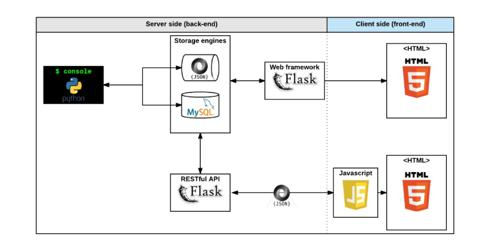

# AirBnB Clone
**AirBnB** is a *complete web application*, integrating database storage, a back-end API, and front-end interface.
The goal of this project is to deploy on our server a simple copy of the [AirBnB website.](https://www.airbnb.com/)



## The Console - Command interpreter
The console is the first step towards building the full Web application. The Console is our command interpreter that will manage
our AirBnB projects - Like a shell in Unix-like systems but limited to a specific use case;  in our case, that is managing the objects of our project i.e:
- Create a new object (ex: a new User or a new Place)
- Retrieve an object from a file, a database etc…
- Do operations on objects (count, compute stats, etc…)
- Update attributes of an object
- Destroy an object

## Usage
clone this repository
```
git clone git@github.com:Beldine-Moturi/AirBnB_clone.git
cd AirBnB_clone
```

#### Starting the Command interpreter
In interactive mode:
**Example**
```
beldine@ubuntu:~$ ./console.py
(hbnb) help

Documented commands (type help <topic>):
========================================
EOF  create  help  quit

Undocumented commands:
======================
all  destroy  show  update

(hbnb) help quit
Exit the program
(hbnb) quit
beldine@ubuntu:~$
```

In non-interactive mode:
**Example**
```
beldine@ubuntu:~$ echo "help" | ./console.py
(hbnb)

Documented commands (type help <topic>):
========================================
EOF  help  quit
(hbnb)
beldine@ubuntu:~$
beldine@ubuntu:~$ cat test_help
help
beldine@ubuntu:~$
beldine@ubuntu:~$ cat test_help | ./console.py
(hbnb)

Documented commands (type help <topic>):
========================================
EOF  help  quit
(hbnb)
beldine@ubuntu:~$
```
The `console` can `create`, `destroy`, and `update` objects. Type `help` within the console to get a list of command options and its function.

### Objects Implemented
This repository contains the following files:

| Folder | File | Description |
| :--- | :--- | :--- |
| tests |  | Contains test files for AirBnb Clone |
|  | console.py | Command line Interpreter for managing AirBnB objects |
| models | base_model.py | Defines all common attributes/methods for other classes |
| models | amenity.py | Creates class `amenity` |
| models | city.py | Creates class `city` |
| models | place.py | Creates class `place` |
| models | review.py | Creates class `review` |
| models | state.py | Creates class `state` |
| models | user.py | Creates class `user` |
| models/engine/ | file_storage.py | Serializes instances to a JSON file and deserializes JSON file to instances |
| web_static | | Contains the static, front-end implementation of the AirBnB project
| To be updated |


## Technologies used
- Language: python, HTML, CSS, Bash
- Operating system: Ubuntu 20.04
- style: Pycodestyle
- Version control: Git

## Authors
- Beldine Moturi | [Linkedin](https://www.linkedin.com/in/beldine-moturi-00811615a/)
- Goodness Atunde | [Github](https://github.com/goody-1)